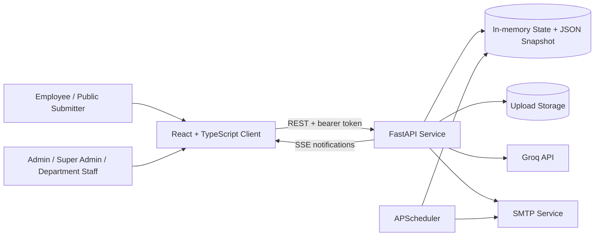

<div align="center">

<h1>feedback_system</h1>
<h3>AI-Assisted Enterprise Feedback Workflow</h3>
<p>From unstructured complaints to routed, trackable, and auditable operational cases.</p>
<p>
  
  
  
  
  
</p>
<p>
  <a href="#overview">Overview</a> ·
  <a href="#system-architecture">Architecture</a> ·
  <a href="#core-workflow">Workflow</a> ·
  <a href="#security--reliability">Security</a> ·
  <a href="#local-development">Development</a>
</p>

</div>

## Overview

feedback_system turns employee submissions into structured cases for triage, routing, response, resolution, and analysis across role, department, and plant boundaries.

Groq-assisted classification, sentiment, root-cause analysis, and reply drafting feed a deterministic case workflow. FastAPI owns validation and authorization; application rules own assignment and state changes. My engineering scope includes React/TypeScript, layered Python services, persistence, uploads, SMTP, scheduled reporting, observability, analytics, and Docker.

## At a Glance

| Area | Implementation |
| --- | --- |
| Primary users | Public submitters, department operators, and super administrators |
| Core workflow | Intake → analysis → routing → review → resolution → analytics |
| Application | React/TypeScript client with a FastAPI service |
| Data | Thread-safe in-memory state with JSON snapshots and filesystem uploads |
| AI | Groq classification and decision support with keyword fallbacks |
| Communication | SMTP replies, scheduled reports, and SSE notifications |

## Engineering Highlights

- **Unstructured-to-structured intake** — public multipart submissions are validated, classified, prioritized, persisted, and routed without requiring the submitter to understand internal departments.
- **Hybrid AI and rules engine** — Groq output is normalized and confidence-checked, while keyword heuristics provide deterministic fallbacks and urgent-keyword escalation.
- **Department and plant scoping** — server-side filters constrain operational queues, analytics, replies, attachments, and management actions by the authenticated user's organizational scope.
- **Operational case lifecycle** — complaints support state transitions, assignments, attachments, notes, watchers, replies, response timing, and SLA analytics.
- **AI-assisted operations** — sentiment, similar-case matching, reply templates, root-cause summaries, recommendations, and natural-language analytics are built around case data rather than a standalone chatbot.
- **Communication pipeline** — public replies can trigger templated SMTP email; scheduled weekly reports aggregate department metrics; per-user notifications can stream over SSE.
- **Observable API boundary** — request IDs, redacted logs, consistent errors, health reporting, and response models make failures traceable.

## System Architecture



## Core Workflow

```text
Feedback Submission
→ Pydantic and file-content validation
→ AI classification with heuristic fallback
→ Department, priority, sentiment, and plant context
→ Deterministic assignment rules
→ Scoped administrative review
→ Reply and status resolution
→ Email, reporting, and analytics
```

> [!NOTE]
> AI contributes classification and decision support. It does not authenticate users, grant roles, bypass department rules, or directly perform privileged administrative changes.

## Key Features

### Feedback & Case Management

- Public multipart intake plus search, pagination, sorting, assignment metadata, notes, watchers, and reply history.
- Configurable SLA thresholds with response, resolution, backlog, and breach metrics.

### AI-Assisted Processing

- Classification with normalized JSON parsing and keyword fallback, plus sentiment, similar-case discovery, reply templates, root-cause analysis, and recommendations.

### Administration & Analytics

- Department and administrator management; scoped dashboards, KPI/trend/sentiment views, scheduled reports, and correlated logs.

### Communication

- Templated reply emails, an in-memory retry queue, timezone-aware weekly reports, and per-user SSE notifications.

## Security & Reliability

- Passwords use bcrypt; legacy hashes are upgraded after a successful login.
- Access and refresh tokens are opaque, randomly generated bearer tokens held in server memory and checked through shared FastAPI dependencies.
- Pydantic models constrain request and response shapes. Complaint list views and many object actions apply server-side department/plant checks.
- Uploads enforce byte limits, MIME sniffing, dangerous double-extension rejection, and server-generated filenames.
- CORS is environment-configured, errors return correlation IDs instead of stack traces, and logging redacts common credential fields.
- Current limitations: browser tokens use `localStorage`, SSE can accept a query-string token, server tokens do not survive restarts or span workers, and the email retry queue processor is not scheduled.
- The JSON datastore is appropriate for a portfolio demo or single-instance deployment, not concurrent multi-replica production traffic.

## Testing & Validation

No automated unit or integration suite is committed. Current gates are static compilation, the production frontend build, linting, and the runtime health endpoint.

```bash
# Backend syntax/import compilation
python -m compileall app

# Frontend type-check and production build
cd frontend
npm run build
```

`npm run lint` is defined but ESLint 9 has no committed flat configuration. The legacy Docker smoke script also has outdated route assumptions; neither is a reliable gate yet.

## Technology Stack

| Responsibility | Technologies |
| --- | --- |
| Frontend | React 18, TypeScript, Vite, Tailwind CSS, TanStack Query, Zustand, Recharts |
| Backend API | FastAPI, Python, Pydantic, Uvicorn |
| Persistence | Thread-safe in-memory store with JSON snapshots; filesystem attachments |
| AI | Groq SDK plus deterministic keyword heuristics |
| Communication | SMTP, Jinja email templates, Server-Sent Events |
| Automation | APScheduler |
| Infrastructure | Docker, Docker Compose |
| Validation | TypeScript/Vite build, Python compile checks, health endpoint |

## Deployment

The root Dockerfile embeds the React build in FastAPI. Docker Compose can also run a separate frontend and provides volumes for JSON data, uploads, and logs.

For a durable deployment:

- mount `DATA_STORE_PATH` and `UPLOAD_DIR` on persistent storage;
- inject Groq, SMTP, and CORS settings through environment variables;
- run one API replica while state remains in process memory;
- enforce TLS, headers, request limits, and rate limiting at the edge;
- verify `/health` and back up the JSON snapshot with uploads.

## Demo

> [!IMPORTANT]
> The login screen pre-fills a seeded account; raw credentials are not repeated here. Replace Super Admin access with a restricted demo role before publication. Previous live links are omitted because they could not be verified.

## Local Development

```bash
git clone https://github.com/Liwei1020T/feedback_system.git
cd feedback_system

python -m venv .venv
source .venv/bin/activate
pip install -r requirements.txt
uvicorn app.main:app --reload --port 8000
```

In another terminal:

```bash
cd frontend
npm ci
# Set VITE_API_URL=http://localhost:8000 in frontend/.env
npm run dev
```

| Service | Local URL |
| --- | --- |
| Frontend | `http://localhost:5174` |
| API | `http://localhost:8000` |
| OpenAPI | `http://localhost:8000/docs` |
| Health | `http://localhost:8000/health` |

## Project Structure

```text
feedback_system/
├── app/routers/             # HTTP endpoints and authorization dependencies
├── app/services/            # AI, assignment, analytics, email, and reports
├── app/models.py            # Domain models and workflow state
├── app/schemas.py           # Request/response contracts
├── app/datastore.py         # In-memory state and JSON persistence
├── frontend/src/            # React application and API client
├── templates/email/         # HTML/text notification templates
├── scripts/                 # Container entrypoint and demo utilities
└── docker-compose.yml       # API, frontend, and persistent volumes
```

## Engineering Decisions

- **AI is paired with heuristics** so intake still classifies and routes when the provider is absent or returns malformed output.
- **Assignment remains deterministic** so model output cannot directly execute privileged actions.
- **Department and plant filters execute on the server** because React route guards are only a user-experience control.
- **JSON persistence minimizes demo dependencies**; PostgreSQL is the next step for transactional production use.
- **The scheduler runs in-process** to keep deployment simple; a separate worker/queue is warranted when horizontal scaling is introduced.
